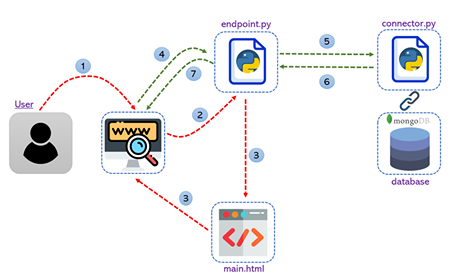
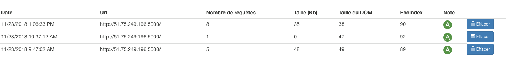

# Design4Green-2018

Challenge of eco-design focused on designing sustainable solutions for everyday purposes. 48 hours non-stop coding challange, November 21-23, 2018.

The task was to develop a web application for online survey consisting of 88 questions.The survey was designed to assess the maturity of companies in France in terms of setting up eco-design digital services. An ultimate objective was to minimize the energy consumption and carbon footprint of the application without hampering user experience.

## Built With

- HTML
- CSS
- Python 2.7
- Java Script
- Flask 1.0.2
- MongoDB 3.2.11

## Description
The solution to the design challenge is composed of one html page with a survey, which content is provided by the challenge organizators. A user is given an opportunity to save answers and share the questionnaire using a generated link.  

## Architecture 



1. User hits the url.

2. The GET request is sent to the Flask server. The functionality is developed in ```endpoint.py```.

3. ```main.html``` file is passed to the user.

4-6. Upon loading ```main.html``` the server pulls questions from MongoDB.

7. The updated html file is shown to the user

## API

| Endpoint address        | Parameters | Content type | Response type |     Method    |
| --------------------    | ------------- | ------------- | ------------- | ---------- |
| /                       |               |                  |  html            | GET  |
| /getAllBasicQuestions   |               | application/json | application/json | POST |
| /saveAllAnswers         | answers       | application/json | application/json | POST |
| /pauseAnswering         | answers       | application/json | application/json | POST |
| /continue               | id            | application/json | application/json | POST |
| /generate               |               |                  | file             | POST |

## Sustainability measurement

1. Our final ecoindex turned out to be 90 (Category A).



2. Source Lines Of Code: 673.

3. Total loading size 30.1 KB.

## Authors

- **Anastasiia Grishina**
- **Feruzjon Muyassarov**
- **Krishna Teja Vaddepalli**
- **Maliha Rahman Mishi**
- **Sami Kabir**

